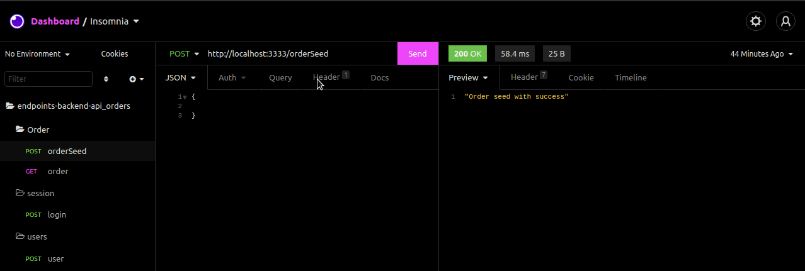
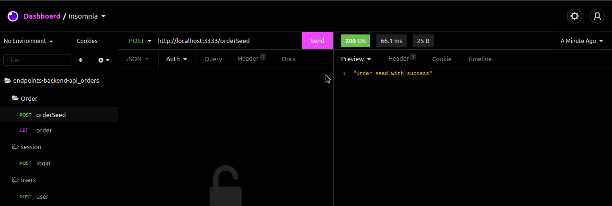

# 💸 Api of Orders

Node Api with JWT for to ferify a list of fake orders.


## 💡 Project and endpoints

Import file called endpoints_backend_api-orders.json in your insomnia or postman.

<div align="center" >
  
</div>


## Run Locally

Clone the project

```bash
  git clone https://github.com/thurdelima/node-api-orders
```

Go to the project directory

```bash
  cd node-api-orders
```

Install dependencies

```bash
  yarn install or yarn
```

Configure .ENV vars and import endpoints_backend_api-orders.json in your postman or insomnia.

Seed fake data orders

<div align="center" >
  
</div>


And

```bash
  yarn start

```


